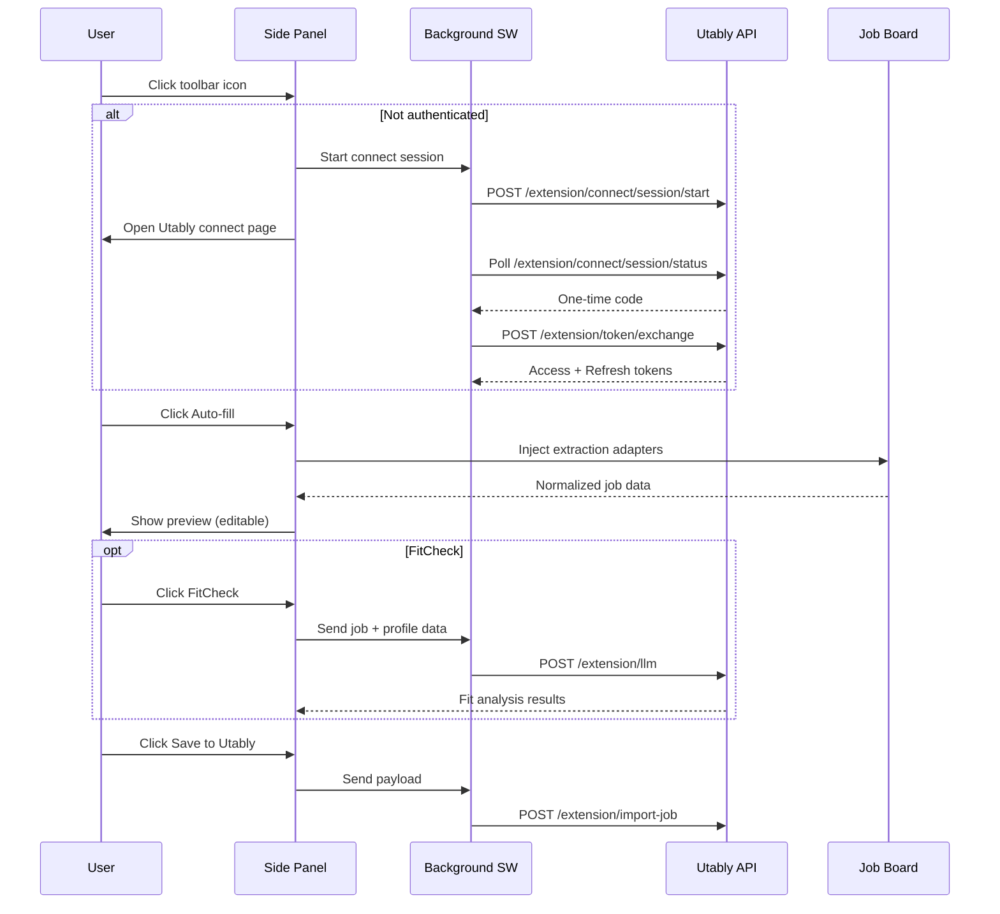

# Architecture

## Runtime Components

1. `manifest.json` — Manifest V3 configuration (permissions, service worker, side panel)
2. `background.js` — Service worker handling auth, API calls, token management, external messaging
3. Side panel UI — `popup.html` + `popup.css` + `popup.js` (module loader)
4. App modules — `popup/app.js` (46KB core logic), `config.js`, `dom.js`, `extraction.js`, `payload.js`, `settings.js`
5. Extraction adapters — 17 adapters in `webpages/` with priority-based routing
6. Content scripts — `content/capture.js` (text capture), `content/extract.js` (reserved)

## User Flow

## Auth & Token Model

- **Connect flow**: Side panel opens Utably app -> app sends `UTABLY_EXTERNAL_CONNECT` message -> background exchanges code for tokens
- **Storage**: `chrome.storage.local` for all tokens and state
- **Access token**: Short-lived, auto-refreshed with 30-second skew buffer
- **Refresh token**: Long-lived, rotated on each refresh call
- **Logout**: Calls `/extension/token/revoke`, clears all stored tokens
- **External messaging**: `onMessageExternal` listener for app-initiated connects

## Storage Keys

| Key | Purpose |
|-----|---------|
| `extAccessToken` | Current access token |
| `extRefreshToken` | Current refresh token |
| `extAccessExpiresAt` | Access token expiry timestamp |
| `extRefreshExpiresAt` | Refresh token expiry timestamp |
| `debugMode` | Debug mode enabled flag |
| `stage` | Current target stage |
| `localPort` | Custom port for local development |
| `utablyDraft` | Form state with `updatedAt` timestamp |
| `utablyCaptureTabs` | Per-tab text capture mode state |
| `utablyConnectPending` | OAuth session ID + expiry |
| `utablyManualFallbackUntil` | Manual code fallback timeout |
| `utablyFitCheckCache` | FitCheck results cache (24h, max 20) |

## Stage Routing

| Stage | API Base | App Base |
|-------|----------|----------|
| `prod` | `https://api.utably.com` | `https://app.utably.com` |
| `dev` | `https://api.dev.utably.com` | `https://app.dev.utably.com` |
| `test` | `https://api.test.utably.com` | `https://app.test.utably.com` |
| `local` | `https://api.dev.utably.com` | `https://app.dev.utably.com:<port>` |

## Permissions

**Declared**: `activeTab`, `scripting`, `storage`, `sidePanel`, `tabs`

**Host permissions** (declared): `https://api.utably.com/*`, `https://api.dev.utably.com/*`, `https://api.test.utably.com/*`

**Optional host permissions**: `https://*/*`, `http://*/*` — requested at runtime per-origin when Auto-fill is used

**Externally connectable**: Utably app URLs for OAuth callback messaging
