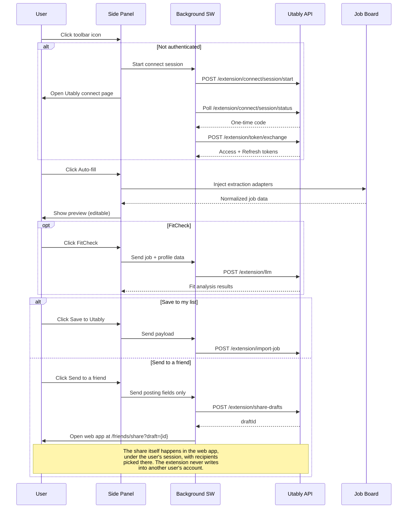

# Architecture

## Runtime Components

1. `manifest.json` — Manifest V3 configuration (permissions, service worker, side panel). `downloads` permission added for the Attachments download action.
2. `background.js` — Service worker handling auth, API calls, token management, external messaging, profile cache, fill-adapter injection, and attachment list/preview/upload/place/download message routes.
3. Side panel UI — `popup.html` + `popup.css` + `popup.js` (module loader)
4. App modules — `popup/app.js` (Import tab + FitCheck modal), `config.js`, `dom.js`, `extraction.js`, `payload.js`, `settings.js`, `i18n.js`, `popup/profile.js` (My profile tab + attachment cards + place-mode handler), `popup/saved.js` (Saved tab, search, status write-back, FitCheck rerun)
5. Extraction adapters — 17 adapters in `webpages/` with priority-based routing (job-data extraction)
6. Fill adapters — 4 adapters in `content/fill/` (`greenhouse.js`, `lever.js`, `ashby.js`, `generic.js`) with plan-verify-apply pattern. See [`fill.md`](fill.md)
7. Attachment-injection scripts — `content/fill/attachments.js` (DataTransfer into matching `<input type="file">`), `content/fill/dropmode.js` (synthesized drop on user-clicked drop zone, top-frame only)
8. Content scripts — `content/capture.js` (text capture), `content/fill/` (autofill + attachment upload), `content/extract.js` (reserved)

## User Flow

## Auth & Token Model

- **Connect flow**: Side panel opens Utably app -> app sends `UTABLY_EXTERNAL_CONNECT` message -> background exchanges code for tokens
- **Storage**: `chrome.storage.local` for all tokens and state
- **Access token**: Short-lived, auto-refreshed with 30-second skew buffer
- **Refresh token**: Long-lived, rotated on each refresh call
- **Logout**: Calls `/extension/token/revoke`, clears all stored tokens
- **External messaging**: `onMessageExternal` listener for app-initiated connects

## Sharing Model

*Send to a friend* passes a captured posting to someone in the user's Utably
circle without saving it as an application first.

The extension does **not** perform the share. Writing into another user's
inbox is a cross-user capability, and the access token lives in
`chrome.storage.local`; granting that capability would mean a stolen token
could reach accounts other than its owner's. Instead:

1. The background worker POSTs the posting to `/extension/share-drafts`,
   which stores it in the **caller's own** account — the same trust level
   `/extension/import-job` already has.
2. The extension opens the Utably web app at `/friends/share?draft=<id>`.
3. The web app, under the user's own session, shows what will be shared and
   performs the share once the user picks recipients.

Only posting fields travel (title, company, location, link, posting text) —
never notes, recruiter details, or FitCheck results. Parked drafts expire on
their own if the user abandons the flow.

## Storage Keys

### `chrome.storage.local` (disk-backed, persists across browser restart)

| Key | Purpose |
|-----|---------|
| `extAccessToken` | Current access token |
| `extRefreshToken` | Current refresh token |
| `extAccessExpiresAt` | Access token expiry timestamp |
| `extRefreshExpiresAt` | Refresh token expiry timestamp |
| `debugMode` | Debug mode enabled flag |
| `stage` | Current target stage |
| `localPort` | Custom port for local development |
| `utablyDraft` | Form state with `updatedAt` timestamp |
| `utablyCaptureTabs` | Per-tab text capture mode state |
| `utablyConnectPending` | OAuth session ID + expiry |
| `utablyManualFallbackUntil` | Manual code fallback timeout |
| `utablyFitCheckCache` | FitCheck results cache (24h, max 20) |
| `utablyFillConsents` | Per-host "remember autofill consent" map. Value is `{ts}` per host; auto-expires after 30 days. Wiped on logout and via *Settings → Autofill privacy → Clear consents*. **Never contains PII.** |

### `chrome.storage.session` (in-memory, wiped on browser restart)

| Key | Purpose |
|-----|---------|
| `utablyProfileCache` | Fillable subset of the user's Utably profile (see [`api.md`](api.md) `GET /extension/profile`). TTL 5 minutes. **Disabled** if the host browser does not provide `chrome.storage.session` — there is no disk fallback. |

## Stage Routing

| Stage | API Base | App Base |
|-------|----------|----------|
| `prod` | `https://api.utably.com` | `https://app.utably.com` |
| `dev` | `https://api.dev.utably.com` | `https://app.dev.utably.com` |
| `test` | `https://api.test.utably.com` | `https://app.test.utably.com` |
| `local` | `https://api.dev.utably.com` | `https://app.dev.utably.com:<port>` |

## Permissions

**Declared**: `activeTab`, `scripting`, `storage`, `sidePanel`, `tabs`

**Host permissions** (declared): `https://api.utably.com/*`, `https://api.dev.utably.com/*`, `https://api.test.utably.com/*`

**Optional host permissions**: `https://*/*`, `http://*/*` — requested at runtime per-origin when Auto-fill is used

**Externally connectable**: Utably app URLs for OAuth callback messaging
